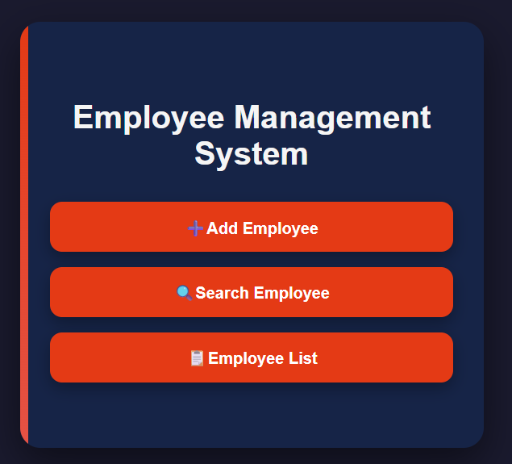

# 👨‍💼 Django Employee Management System

### Project 4 — Final Project of the Django Learning Project Series

A web-based **Employee Management System** built using **Python and Django** to manage employee records through a clean and simple web interface.

This project is the **4th and final project in my current Django Learning Project Series**, where I practiced the fundamentals of Django by building practical applications and gradually improving my understanding of backend development.

---

### 📌 Project Series Completed

With the completion of this project, the **current Django Learning Project Series is complete**.

These four projects helped build a practical foundation in:

1. **Django To-Do Application** ✅
2. **Django FunQuiz 🎮** ✅
3. **Django Travel Booking ✈️** ✅
4. **Employee Management System 👨‍💼** ✅

```text
Python
   ↓
Django
   ↓
Templates & URLs
   ↓
Database
   ↓
CRUD
   ↓
Search
   ↓
Media & Image Handling
   ↓
Git & GitHub
```
--- 

## 📌 About the Project

The Employee Management System provides a simple platform to manage employee records.

The application allows users to:

* ➕ Add new employees
* 📋 View employee records
* 🔍 Search employees by Employee ID
* 👨‍💼 Search employees by designation
* ✏️ Edit employee information
* 🖼️ Upload employee profile images
* 🔄 Change employee profile images
* 👁️ View employee images
* 🗑️ Delete employees with confirmation

The project follows Django's **Model-View-Template (MVT)** architecture and uses **SQLite** for database management.

---

## ✨ Features

### ➕ Add Employee

Users can add a new employee by providing:

* Employee ID
* Employee Name
* Designation
* Experience
* Profile Image

Employee information is stored in the database after submission.

### 📋 Employee List

The Employee List displays all registered employees along with their:

* Employee ID
* Name
* Designation
* Experience
* Profile Image
* Edit option
* Delete option

### 🔍 Search

Employees can be searched using:

**Search by Employee ID**

Find an employee using their unique Employee ID.

**Search by Designation**

Find employees based on their designation using case-insensitive matching.

### ✏️ Edit Employee

Existing employee information can be updated.

Users can modify:

* Name
* Designation
* Experience
* Profile Image

### 🖼️ Image Management

The application supports employee profile image handling.

Users can:

* Upload an image while adding an employee
* View employee images
* Open an employee image
* Change an existing employee image

Django's `ImageField` is used for image management.

### 🗑️ Delete Employee

Employees can be deleted from the system.

A confirmation page is displayed before deletion to help prevent accidental removal.

---

# 🏗️ Django Architecture

The application follows Django's **MVT (Model-View-Template)** architecture.

```text
                         User
                           │
                           ▼
                      URL Routing
                           │
                           ▼
                         Views
                       /       \
                      /         \
                     ▼           ▼
                  Models      Templates
                     │           │
                     ▼           ▼
                SQLite DB    HTML Response
```

### Model

Defines the employee data structure and database fields.

### View

Handles the application's business logic, including:

* Creating employees
* Displaying employees
* Searching employees
* Updating employees
* Deleting employees

### Template

Provides the user interface and displays dynamic employee information.

---

# 🗄️ Employee Model

The project uses an `Employee` model with the following fields:

| Field         | Type         | Description            |
| ------------- | ------------ | ---------------------- |
| `emp_id`      | CharField    | Unique employee ID     |
| `name`        | CharField    | Employee name          |
| `designation` | CharField    | Employee designation   |
| `experience`  | IntegerField | Employee experience    |
| `image`       | ImageField   | Employee profile image |

The `emp_id` field is unique to prevent duplicate employee records.

---

# 🔄 CRUD Operations

The project implements complete **CRUD functionality**.

```text
              CREATE
                 │
                 ▼
           Add Employee
                 │
                 ▼
                READ
                 │
                 ▼
          Employee List
             /       \
            /         \
           ▼           ▼
        UPDATE       DELETE
           │           │
           ▼           ▼
    Edit Employee   Confirmation
           │           │
           └─────┬─────┘
                 ▼
          Employee List
```

### Create

Add a new employee record.

### Read

View employee records through the Employee List.

### Update

Modify existing employee information.

### Delete

Remove an employee after confirmation.

---

# 🔍 Search Workflow

## Search by Employee ID

```text
Enter Employee ID
        │
        ▼
Search Request
        │
        ▼
Database Query
        │
        ▼
Employee Found?
      /     \
    Yes      No
     │        │
     ▼        ▼
 Display     Error
 Employee    Message
```

## Search by Designation

```text
Enter Designation
        │
        ▼
Search Request
        │
        ▼
Case-Insensitive Query
        │
        ▼
Matching Employees
        │
        ▼
Display Results
```

---

# 🖼️ Image Upload Workflow

```text
Add Employee
     │
     ▼
Select Image
     │
     ▼
Form Submission
     │
     ▼
request.FILES
     │
     ▼
Employee ImageField
     │
     ▼
Media Storage
     │
     ▼
Display Image
```

---

# 🛠️ Technologies Used

| Technology       | Purpose                |
| ---------------- | ---------------------- |
| Python           | Backend programming    |
| Django 5.2       | Web framework          |
| SQLite           | Database               |
| HTML5            | Page structure         |
| CSS3             | Styling                |
| Django Templates | Dynamic page rendering |
| Pillow           | Image processing       |
| Git              | Version control        |
| GitHub           | Repository hosting     |

---

# 📂 Project Structure

```text
employee_management/
│
├── employee_management/
│   ├── __init__.py
│   ├── settings.py
│   ├── urls.py
│   ├── asgi.py
│   └── wsgi.py
│
├── employees/
│   │
│   ├── migrations/
│   │   ├── 0001_initial.py
│   │   ├── 0002_rename_designation_employee_role.py
│   │   ├── 0003_rename_role_employee_designation.py
│   │   ├── 0004_employee_image.py
│   │   └── __init__.py
│   │
│   ├── static/
│   │   └── employees/
│   │       └── delete.css
│   │
│   ├── templates/
│   │   └── employees/
│   │       ├── add_employee.html
│   │       ├── base.html
│   │       ├── delete_confirm.html
│   │       ├── edit_employee.html
│   │       ├── employee_list.html
│   │       ├── home.html
│   │       ├── profile.html
│   │       ├── search_by_id.html
│   │       ├── search_by_role.html
│   │       └── search_options.html
│   │
│   ├── __init__.py
│   ├── admin.py
│   ├── apps.py
│   ├── models.py
│   ├── tests.py
│   ├── urls.py
│   └── views.py
│
├── screenshots/
│   ├── home.png
│   ├── add-employee.png
│   ├── employee-list.png
│   ├── search.png
│   ├── search-by-id.png
│   ├── search-by-role.png
│   ├── edit-employee.png
│   └── delete-confirmation.png
│
├── manage.py
├── .gitignore
└── README.md
```

---

# ⚙️ Installation & Setup

## 1. Clone the Repository

```bash
git clone https://github.com/yuvashreedhanasekaren-coder/django-employee-management.git
```

## 2. Navigate to the Project

```bash
cd django-employee-management
```

## 3. Create a Virtual Environment

```bash
python -m venv venv
```

## 4. Activate the Virtual Environment

### Windows PowerShell

```powershell
.\venv\Scripts\Activate.ps1
```

## 5. Install Dependencies

```bash
pip install django pillow
```

## 6. Apply Migrations

```bash
python manage.py migrate
```

## 7. Run Django System Check

```bash
python manage.py check
```

Expected result:

```text
System check identified no issues (0 silenced).
```

## 8. Start the Development Server

```bash
python manage.py runserver
```

Open the application at:

```text
http://127.0.0.1:8000/
```

---

# 🧪 Testing & Verification

The application was tested through the major workflows.

### Home Page

* Home page loads successfully
* Navigation links work correctly

### Add Employee

* Employee can be added
* Employee information is stored
* Employee image can be uploaded

### Employee List

* Employee records are displayed
* Employee images are displayed
* Edit and Delete options are available

### Search

* Employee ID search works
* Designation search works
* No-result searches display an appropriate message

### Edit

* Employee details can be updated
* Employee image can be changed
* Updated information is saved

### Delete

* Delete confirmation page works
* Employee can be deleted
* Deleted employee no longer appears in the list

### Django System Check

```bash
python manage.py check
```

Result:

```text
System check identified no issues (0 silenced).
```

---

# 🌐 URL Structure

| URL                 | Function              |
| ------------------- | --------------------- |
| `/`                 | Home page             |
| `/add/`             | Add employee          |
| `/list/`            | Employee list         |
| `/search/`          | Search options        |
| `/search/id/`       | Search by Employee ID |
| `/search/role/`     | Search by Role        |
| `/edit/<emp_id>/`   | Edit employee         |
| `/delete/<emp_id>/` | Delete employee       |

---

# 📸 Screenshots

## 🏠 Home Page



> Additional screenshots for **Add Employee, Employee List, Search, Search by ID, Search by Role, Edit Employee, and Delete Confirmation** are available in the `screenshots/` folder.

---

# 📚 Django Concepts Practiced

Through this project, I practiced:

* Django project structure
* Django applications
* MVT architecture
* Models and model fields
* SQLite database
* Database migrations
* Views
* URL routing
* Django templates
* Template inheritance
* Static files
* Media files
* ImageField
* Image upload
* GET and POST requests
* QuerySets
* `filter()`
* `get()`
* `get_object_or_404()`
* CRUD operations
* Redirects
* Form handling
* `request.POST`
* `request.FILES`
* Case-insensitive database filtering
* Git and GitHub workflow

---

# 🔐 Git & GitHub

Git was used to manage the project's source code and version history.

### Branch

```text
main
```

### Initial Commit

```text
Add Employee Management System
```

### Repository

https://github.com/yuvashreedhanasekaren-coder/django-employee-management

The project also includes a `.gitignore` file to keep environment-specific and generated files out of the repository.

Ignored files include:

```text
venv/
env/
__pycache__/
*.py[cod]
db.sqlite3
.env
.vscode/
.idea/
media/
```

---

# 🎯 Learning Outcome

This project helped strengthen my practical understanding of Django by implementing a complete database-driven application.

Key areas practiced:

* Backend development with Django
* MVT architecture
* CRUD operations
* Database management
* Search functionality
* Image upload and media handling
* Template-based web development
* URL routing
* Database queries
* Form processing
* Git and GitHub workflow

---

# 👩‍💻 Learning Series

This Employee Management System is the **4th and final project of my current Django Learning Project Series**.

The series was created to learn Django practically by building multiple projects from the basics and gradually working with real application features.

```text
Django Learning Project

        │

        ├── Project 1 → To-Do Application ✅

        │

        ├── Project 2 → FunQuiz 🎮 ✅

        │

        ├── Project 3 → Travel Booking ✈️ ✅

        │

        └── Project 4 → Employee Management System 👨‍💼 ✅
```

---

# 🚀 What's Next?

The basic Django learning project series is now completed.

The next stage is to move from smaller learning projects to **larger and more practical projects** using the skills developed throughout this series.

Future projects will focus on combining:

* Python
* Django
* Web Design
* Framework-based development
* Backend Development
* MySQL
* Database-driven applications
* Real-world application architecture

The goal is to build **larger, more complete projects** rather than only small practice applications.

---

# ✅ Project Status

**Completed — Final Project of the Current Django Learning Series**

* ✅ Application developed
* ✅ CRUD functionality implemented
* ✅ Search functionality implemented
* ✅ Image upload implemented
* ✅ Image viewing implemented
* ✅ Image editing implemented
* ✅ Delete confirmation implemented
* ✅ Application tested
* ✅ Django system check completed
* ✅ Project cleaned
* ✅ Git repository created
* ✅ Project pushed to GitHub
* ✅ README documented
* ✅ Screenshots added

---

## 👩‍💻 Django Learning Project Series

This project is part of my Django Learning Project Series, where I build practical applications to progressively strengthen my Django and backend development skills.

Django Learning Project

        │

        ├── Project 1 → To-Do Application ✅

        │

        ├── Project 2 → FunQuiz 🎮 ✅

        │

        ├── Project 3 → Travel Booking ✈️ ✅

        │

        └── Project 4 → Employee Management System 👨‍💼 ✅
---

## ⭐ GitHub Repository

**Django Employee Management System**

https://github.com/yuvashreedhanasekaren-coder/django-employee-management
